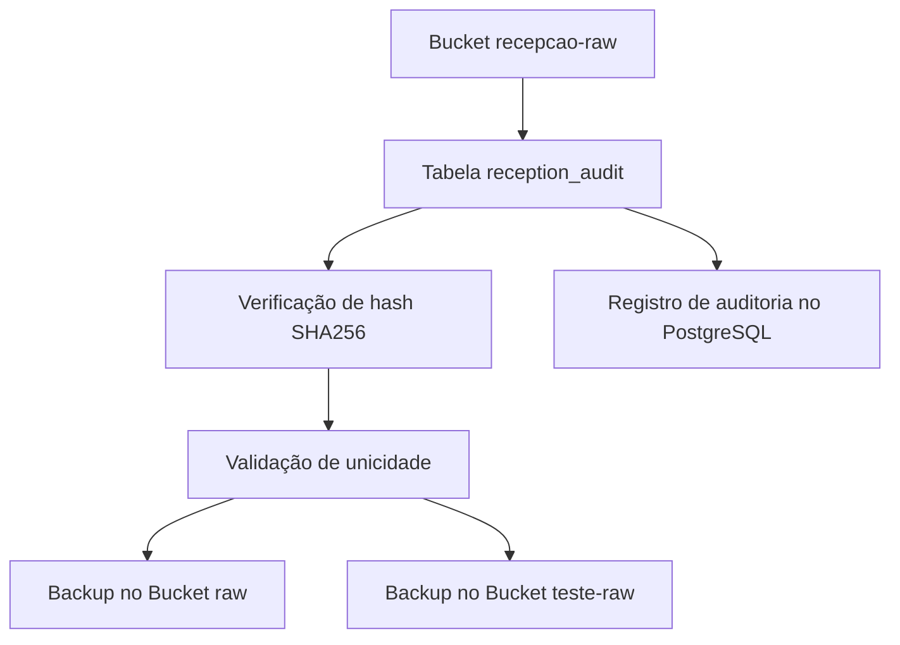

```markdown
## 📄 Resumo Técnico — `pipeline-projeto.md`

Este resumo consolida os principais pontos do documento técnico que descreve o pipeline de ingestão, backup e auditoria de dados em um ambiente baseado em MinIO, PostgreSQL e containers Docker.

---

### 🧱 Infraestrutura

- ☁️ **MinIO**
  - Buckets:
    - `recepcao-raw` — dados originais (fonte principal)
    - `teste-raw` — ambiente de testes/simulações
    - `raw` — backup consolidado
- 🗄️ **PostgreSQL**
  - Base ativa: `postgres`
  - Tabela crítica: `reception_audit`
- 💻 **Ambiente**
  - Jupyter Notebook (`jupyter-cpu`)
  - VSCode Desktop
  - Obsidian (documentação)
  - Ferramentas: `mc`, `pgcli`

---

### 🔄 Fluxo do Pipeline



---

### 🧠 Observações

- Toda movimentação de arquivos é auditada.
- O bucket `raw` é o repositório final de arquivos únicos.
- O bucket `teste-raw` serve para testes e simulações.

---

### 📑 Próximas Ações

- Validar integridade entre o banco `reception_audit` e o MinIO.
- Automatizar backups (`mc mirror`).
- Criar rotina de limpeza para `teste-raw`.
- Padronizar documentação técnica e operacional.

---

### 📦 Buckets — Status Atual
^recepcao-raw-bloco
- 🟩 `recepcao-raw` — completo e funcional  
- 🟨 `teste-raw` — 50 MiB / 15.410 objetos  
- ⬜ `raw` — vazio, preparado para consolidar backup

---

### 🗄️ Banco de Dados — Status

| Tabela               | Status                     |
|----------------------|----------------------------|
| `arquivos_processados` | ❌ Deletada (estava vazia)  |
| `projetos`             | ❌ Deletada (estava vazia)  |
| `reception_audit`      | ✅ Ativa e funcional        |

---

### 📚 Histórico do Documento

| Data       | Alteração                      | Autor  |
|------------|-------------------------------|--------|
| 2025-05-26 | Criação inicial do pipeline   | WRM    |
| 2025-05-27 | Adição do fluxo de backup     | IA GPT |

---

🔗 Documento completo:  
[[pipeline-projeto.md#recepcao-raw-detalhes]]
```

