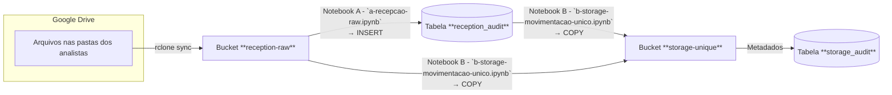

# Pipeline de Ingestão & Governança de Arquivos  
### FIAP – DEEP LEARNING (exemplo)

> **Última revisão:** 2025‑05-31 12:13 UTC

---

## 1. Visão geral



* **Buckets S3/MinIO**
  | Papel | Nome | Conteúdo |
  |-------|------|----------|
  | Entrada bruta | `reception-raw` | Cópia 1‑para‑1 do Google Drive, preservando a árvore de pastas original |
  | Dedicado a projetos | `storage-unique` | Somente **arquivos únicos**, já prefixados pelo projeto (`FDL/…`, `ABC/…`, …) |

* **Notebooks**
  | Notebook | Função |
  |----------|--------|
  | **A – Recepção Raw** | Varre `reception-raw`, calcula SHA‑256 e popula `reception_audit`. Não move arquivos. |
  | **B – Movimentação Únicos** | Copia, via _server‑side copy_, apenas os hashes que ainda **não** estão na `storage_audit`, aplicando o prefixo do projeto. |

* **Registry**  
  A tabela `projects_registry` centraliza os projetos ativos e seus _prefixes_ para evitar colisão de nomes.

---

## 2. Esquema das tabelas

### 2.1 `projects_registry`

| Coluna | Tipo | Not null | Descrição |
|--------|------|----------|-----------|
| `project_name` | `varchar` | ✅ | Nome legível do projeto |
| `prefix` | `varchar` | ✅ | Prefixo único usado nos caminhos (`FDL`, `ABC`, …) |
| `active` | `bool` | ✅ | Controle de ativação (UI só lista `TRUE`) |
| `created_at` *(opcional)* | `timestamptz` | — | Auto‑timestamp |

**Exemplo**

| project_name | prefix | active |
|--------------|--------|--------|
| FIAP – DEEP LEARNING | `FDL` | `t` |

---

### 2.2 `reception_audit`

Metadados **imutáveis** gerados na chegada.

| Coluna | Tipo | Not null | Exemplo |
|--------|------|----------|---------|
| `id` | `serial` PK | ✅ | 17 834 |
| `diretorio_origem` | `text` | — | `BBAS3.SA` |
| `caminho_relativo` | `text` | ✅ | `BBAS3.SA/imagens/teste/comprar/2019‑04‑30_1.png` |
| `nome_arquivo` | `varchar` | ✅ | `2019‑04‑30_1.png` |
| `size_bytes` | `bigint` | ✅ | 2 452 |
| `hash_sha256` | `text` | ✅ | `e3b0c442…` |
| `ingested_at` | `timestamptz` | ✅ *(default)* | `2025‑05‑31 09:00` |

> **Chave natural:** `hash_sha256`. Duplicatas são permitidas (mesmo arquivo em pastas diferentes).

---

### 2.3 `storage_audit`

Metadados da **cópia única** (1 linha por arquivo efetivo no bucket de destino).

| Coluna | Tipo | Not null | Descrição |
|--------|------|----------|-----------|
| `id` | `serial` PK | ✅ | — |
| `prefix` | `varchar` | ✅ | Prefixo do projeto |
| `project_name` | `varchar` | ✅ | Nome legível |
| `bucket` | `varchar` | ✅ | Sempre `storage-unique` |
| `full_path` | `text` | ✅ | `FDL/BBAS3.SA/imagens/teste/comprar/2019‑04‑30_1.png` |
| `filename` | `varchar` | ✅ | `2019‑04‑30_1.png` |
| `size_bytes` | `bigint` | ✅ | 2 452 |
| `source_bucket` | `varchar` | ✅ | `reception-raw` |
| `hash_sha256` | `text` | — | Igual ao da recepção |
| `diretorio_origem` | `text` | — | `BBAS3.SA` |
| `caminho_minio` | `text` | — | **mesmo** que `full_path` |
| `copied_at` | `timestamptz` | — *(default `now()`)* | Quando foi copiado |
| `upload_date` | `timestamp` | — *(legado do MinIO)* | |

**Regras de integridade**

* `(prefix, full_path)` é **único** dentro do bucket.  
* O notebook filtra por `hash_sha256` para impedir cópia duplicada.

---

## 3. Fluxo detalhado

1. **Sync Google Drive → `reception-raw`**  
   ```bash
   rclone sync "gdrive:Equipe/" "minio/reception-raw/"
   ```
   *Sem sobrescrever versões anteriores.*

2. **Notebook A – `a-recepcao-raw.ipynb`**  
   * Lista recursiva do bucket.  
   * Calcula SHA‑256 (streaming).  
   * Inserta/ignora (`ON CONFLICT DO NOTHING`) na `reception_audit`.

3. **Notebook B – `b-storage-movimentacao-unico.ipynb`**  
   1. Usuário escolhe **projeto** (dropdown) ou cria novo.  
   2. Query identifica hashes **ainda não migrados**.  
   3. Para cada hash:  
      * **Sanitização do path** – remove `reception-raw/` & primeira pasta do Google.  
      * Concatena `prefix/`.  
      * `CopySource` S3 → `storage-unique`.  
      * `storage_audit` recebe a linha (todas colunas preenchidas).  
   4. Progresso é mostrado em barra `widgets.IntProgress`.

4. **Governança / salvaguardas**
   * **Prefixo obrigatório** evita colisões entre times.  
   * `projects_registry` centraliza prefixos, permitindo criar bloqueio se repetido.  
   * Auditorias permitem “reprocessar” cópias sem baixar novamente; basta truncar `storage_audit` e rodar o Notebook B.  
   * Logs de hash tornam o pipeline **idempotente**: executar duas vezes não duplica arquivos.

---

## 4. Exemplos de linha em `storage_audit`

| prefix | full_path | size_bytes | diretorio_origem |
|--------|-----------|-----------:|------------------|
| `FDL` | `FDL/BBAS3.SA/imagens/teste/comprar/2019‑04‑30_1.png` | 2 452 | `BBAS3.SA` |
| `FDL` | `FDL/BBAS3.SA/teste.csv`                              | 392 516 | `BBAS3.SA` |
| `ABC` | `ABC/DADOS/relatorio.html`                            | 4 315 900 | `DADOS` |

---

## 5. Tarefas agendadas / checklist

| Item | Frequência | Responsável |
|------|------------|-------------|
| **`rclone` sync** Google Drive → `reception-raw` | Diário 08:00 | DevOps |
| Notebook A | Diário 08:30 | Airflow |
| Notebook B | On‑demand (botão) | Data Engineer |
| Auditoria de consistência bucket × tabela | Semanal | DBA |

---

## 6. Extensões futuras

* **Constraint UNIQUE(hash_sha256)** via `CREATE UNIQUE INDEX CONCURRENTLY …` para garantir unicidade sem lock.  
* Destino adicional `storage-curated` após validação de qualidade.  
* Logs de falha (`dead_letter`) para hashes que não puderem ser copiados.

---

> _Documento gerado automaticamente pelo ChatGPT o3._

