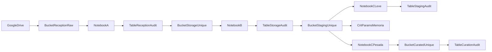

### FIAP – DEEP LEARNING (exemplo)

> **Última revisão:** 2025‑06‑01

---

## 1. Visão geral




## Buckets S3/MinIO

| Papel | Nome | Conteúdo |
|-------|------|----------|
| Entrada bruta | `reception-raw` | Cópia 1-para-1 do Google Drive, preservando a árvore de pastas original |
| Dedicado a projetos | `storage-unique` | Somente **arquivos únicos**, já prefixados pelo projeto (`FDL/…`, `ABC/…`, …) |
| Staging técnico | `staging-unique` | Imagens válidas aguardando curadoria pesada |
| Curadoria final | `curated-unique` | Imagens aprovadas e convertidas para DL/RL |

## Notebooks

| Notebook | Função |
|----------|--------|
| **A – Recepção Raw** | Varre `reception-raw`, calcula SHA‑256 e popula `reception_audit`. Não move arquivos. |
| **B – Movimentação Únicos** | Copia, via _server‑side copy_, apenas os hashes que ainda não estão na `storage_audit`, aplicando o prefixo do projeto. |
| **C – Curadoria (leve e pesada)** | Valida as imagens, aplica critérios técnicos e registra o resultado da curadoria na `curation_audit`. |


---

## 2. Esquema das tabelas

### 2.1 `projects_registry`

| Coluna | Tipo | Not null | Descrição |
|--------|------|----------|-----------|
| --- | --- | --- | --- |
| `project_name` | `varchar` | ✅ | Nome legível do projeto |
| --- | --- | --- | --- |
| `prefix` | `varchar` | ✅ | Prefixo único usado nos caminhos (`FDL`, `ABC`, …) |
| --- | --- | --- | --- |
| `active` | `bool` | ✅ | Controle de ativação |
| --- | --- | --- | --- |
| `created_at` | `timestamptz` | — | Auto‑timestamp |

### 2.2 `reception_audit`

| Coluna | Tipo | Not null | Exemplo |
|--------|------|----------|---------|
| --- | --- | --- | --- |
| `id` | `serial` PK | ✅ | 17834 |
| --- | --- | --- | --- |
| `diretorio_origem` | `text` | — | `BBAS3.SA` |
| --- | --- | --- | --- |
| `caminho_relativo` | `text` | ✅ | `BBAS3.SA/imagens/teste/comprar/2019‑04‑30_1.png` |
| --- | --- | --- | --- |
| `nome_arquivo` | `varchar` | ✅ | `2019‑04‑30_1.png` |
| --- | --- | --- | --- |
| `size_bytes` | `bigint` | ✅ | 2452 |
| --- | --- | --- | --- |
| `hash_sha256` | `text` | ✅ | `e3b0c442…` |
| --- | --- | --- | --- |
| `ingested_at` | `timestamptz` | ✅ | `2025‑05‑31 09:00` |

### 2.3 `storage_audit`

| Coluna | Tipo | Not null | Descrição |
|--------|------|----------|-----------|
| --- | --- | --- | --- |
| `id` | `serial` PK | ✅ | — |
| --- | --- | --- | --- |
| `prefix` | `varchar` | ✅ | Prefixo do projeto |
| --- | --- | --- | --- |
| `project_name` | `varchar` | ✅ | Nome legível |
| --- | --- | --- | --- |
| `bucket` | `varchar` | ✅ | Sempre `storage-unique` |
| --- | --- | --- | --- |
| `full_path` | `text` | ✅ | Caminho final no bucket |
| --- | --- | --- | --- |
| `filename` | `varchar` | ✅ | Nome do arquivo |
| --- | --- | --- | --- |
| `size_bytes` | `bigint` | ✅ | Tamanho em bytes |
| --- | --- | --- | --- |
| `source_bucket` | `varchar` | ✅ | Sempre `reception-raw` |
| --- | --- | --- | --- |
| `hash_sha256` | `text` | — | Mesma hash da recepção |
| --- | --- | --- | --- |
| `diretorio_origem` | `text` | — | Diretório do GDrive |
| --- | --- | --- | --- |
| `caminho_minio` | `text` | — | Igual ao `full_path` |
| --- | --- | --- | --- |
| `copied_at` | `timestamptz` | — | Timestamp da cópia |
| --- | --- | --- | --- |
| `upload_date` | `timestamp` | — | Legado |

### 2.4 `staging_audit`

| Coluna | Tipo | Not null | Descrição |
|--------|------|----------|-----------|
| --- | --- | --- | --- |
| `prefix` | `varchar` | ✅ | Prefixo do projeto |
| --- | --- | --- | --- |
| `filename` | `varchar` | ✅ | Nome do arquivo |
| --- | --- | --- | --- |
| `file_ext` | `varchar` | ✅ | Extensão |
| --- | --- | --- | --- |
| `bucket_origem` | `varchar` | ✅ | Bucket original |
| --- | --- | --- | --- |
| `bucket_destino` | `varchar` | ✅ | Bucket staging |
| --- | --- | --- | --- |
| `status` | `varchar` | ✅ | `not_processed` |
| --- | --- | --- | --- |
| `curation_type` | `varchar` | ✅ | Tipo da curadoria |
| --- | --- | --- | --- |
| `curation_status` | `varchar` | ✅ | `not_processed` |
| --- | --- | --- | --- |
| `timestamp` | `timestamptz` | ✅ | Data de entrada |
| --- | --- | --- | --- |
| `tipo` | `varchar` | — | Descritivo técnico |
| --- | --- | --- | --- |
| `finalidade` | `varchar` | — | Tipo lógico |
| --- | --- | --- | --- |
| `full_path` | `text` | — | Caminho completo |
| --- | --- | --- | --- |
| `novo_nome` | `varchar` | — | Nome pós-tratamento |
| --- | --- | --- | --- |
| `comentario` | `text` | — | Mensagem de erro |

### 2.5 `curation_audit`

| Coluna | Tipo | Not null | Descrição |
|--------|------|----------|-----------|
| --- | --- | --- | --- |
| `prefix` | `varchar` | ✅ | Prefixo |
| --- | --- | --- | --- |
| `filename` | `varchar` | ✅ | Nome |
| --- | --- | --- | --- |
| `file_ext` | `varchar` | ✅ | `.png` |
| --- | --- | --- | --- |
| `curation_type` | `varchar` | ✅ | DL / RL |
| --- | --- | --- | --- |
| `curation_status` | `varchar` | ✅ | `processed` |
| --- | --- | --- | --- |
| `full_path` | `text` | ✅ | Caminho final |
| --- | --- | --- | --- |
| `source_path` | `text` | ✅ | Origem da imagem |
| --- | --- | --- | --- |
| `bucket_origin` | `varchar` | ✅ | `staging-unique` |
| --- | --- | --- | --- |
| `bucket_curated` | `varchar` | ✅ | `curated-unique` |
| --- | --- | --- | --- |
| `curation_details` | `jsonb` | ✅ | Métricas da curadoria |
| --- | --- | --- | --- |
| `timestamp` | `timestamptz` | ✅ | Data de registro |

---

## 3. Fluxo detalhado

1. **Sync Google Drive → `reception-raw`**  
   Executado com `rclone`.

2. **Notebook A – Recepção**  
   Calcula `hash_sha256` e preenche `reception_audit`.

3. **Notebook B – Movimentação Únicos**  
   Copia arquivos únicos para `storage-unique`, registra `storage_audit`.

4. **Notebook C – Curadoria**  
   - Valida imagem (`PIL`) → `staging_audit`  
   - Diagnóstico técnico → `crit_params`  
   - Aplicação de critérios → `curation_audit` + `curated-unique`

---

## 4. Exemplo final – linha em `curation_audit`

```json
{
  "prefix": "FDL",
  "filename": "2020-01-01_1.png",
  "file_ext": ".png",
  "curation_type": "DL",
  "curation_status": "processed",
  "full_path": "curated-unique/FDL/2020-01-01_1.png",
  "source_path": "FDL/BBAS3/imagens/raw/2020-01-01_1.png",
  "bucket_origin": "staging-unique",
  "bucket_curated": "curated-unique",
  "curation_details": {
    "res_w": 100,
    "res_h": 100,
    "aspect_ratio": 1.0,
    "std": 15.6,
    "modo_final": "L"
  },
  "timestamp": "2025-06-01T15:00:00"
}
```